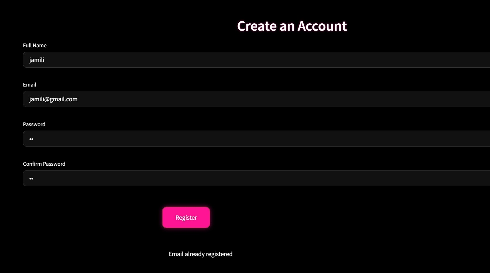
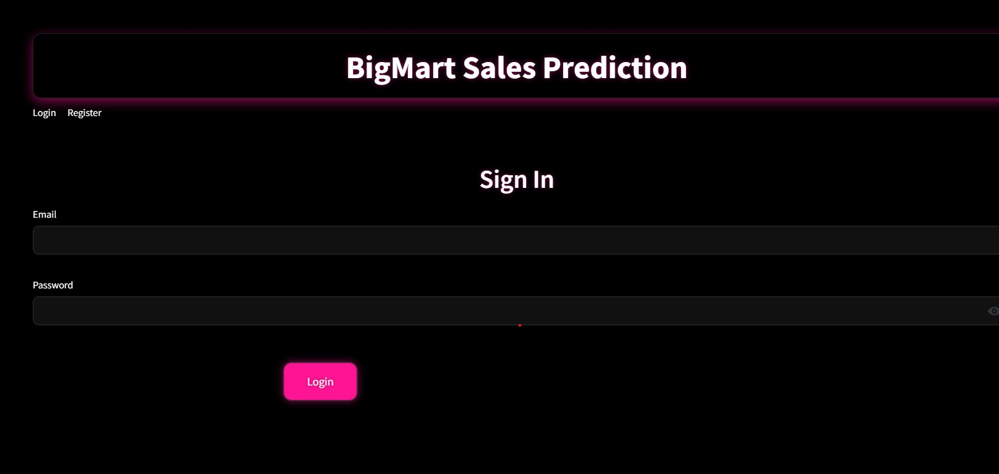
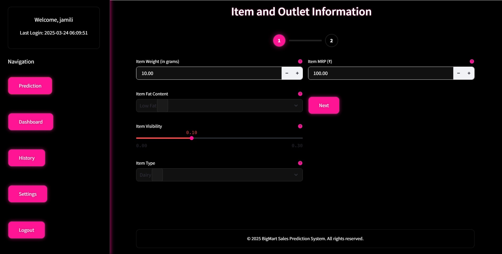
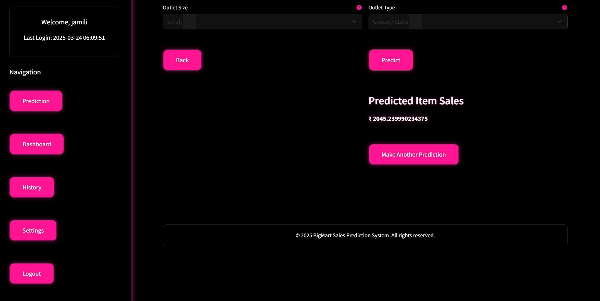
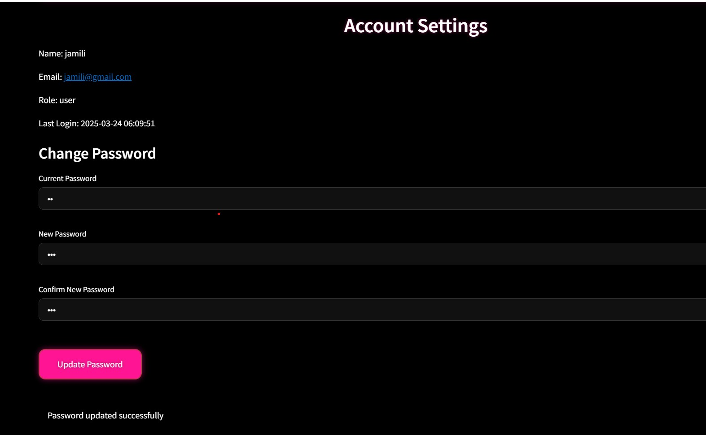

# BigMart Sales Prediction

## Overview
The BigMart Sales Prediction project aims to predict sales for various products across different BigMart stores using machine learning techniques. This project utilizes historical sales data to build predictive models that can help in inventory management, sales forecasting, and strategic planning.
## Live Website
https://bigmart-sales-prediction-2.onrender.com/

## Table of Contents
- [Tech Stack](#tech-stack)
- [Features](#features)
- [Installation](#installation)
- [Usage](#usage)
- [Data](#data)
- [Modeling](#modeling)
- [Demo Screenshots](#Demo Screenshots)


## Tech Stack
- **Programming Language**: Python
- **Libraries**:
  - Pandas
  - NumPy
  - Scikit-learn
  - Matplotlib
  - Seaborn
  - Jupyter Notebook
- **Environment**: Anaconda or virtualenv

## Features
- **Data Preprocessing**: Clean and preprocess sales data for analysis.
- **Exploratory Data Analysis (EDA)**: Visualize sales trends and patterns using graphs and charts.
- **Feature Engineering**: Create new features to improve model performance.
- **Model Training**: Train various machine learning models (e.g., Linear Regression, Random Forest, XGBoost) to predict sales.
- **Model Evaluation**: Evaluate model performance using metrics such as RMSE, MAE, and R².
- **Prediction**: Generate sales predictions for future periods based on the trained model.

## Installation
To set up the project locally, follow these steps:

1. Clone the repository:
   ```bash
   git clone https://github.com/yourusername/bigmart-sales-prediction.git
   cd bigmart-sales-prediction
   ```

2. Create a virtual environment:
   ```bash
   # Using virtualenv
   python -m venv venv
   source venv/bin/activate  # On Windows, use: venv\Scripts\activate
   
   # Or using conda
   conda create -n bigmart-env python=3.8
   conda activate bigmart-env
   ```

3. Install dependencies:
   ```bash
   pip install -r requirements.txt
   ```

## Usage
To use this project for sales prediction:

1. Run Jupyter Notebook:
   ```bash
   jupyter notebook
   ```

2. Open the main notebook:
   ```
   notebooks/bigmart_sales_prediction.ipynb
   ```

3. Follow the step-by-step instructions in the notebook to:
   - Load and explore the data
   - Preprocess and clean the dataset
   - Train prediction models
   - Evaluate model performance
   - Generate predictions

## Data
The dataset contains sales information for products across different BigMart stores:

### Data Fields
- **Item_Identifier**: Unique product ID
- **Item_Weight**: Weight of product
- **Item_Fat_Content**: Whether the product is low fat or regular
- **Item_Visibility**: The percentage of total display area allocated to the product
- **Item_Type**: Category to which the product belongs
- **Item_MRP**: Maximum Retail Price (list price) of the product
- **Outlet_Identifier**: Unique store ID
- **Outlet_Establishment_Year**: The year in which the store was established
- **Outlet_Size**: The size of the store in terms of ground area covered
- **Outlet_Location_Type**: The type of area in which the store is located
- **Outlet_Type**: Whether the outlet is a grocery store or some sort of supermarket
- **Item_Outlet_Sales**: Sales of the product in the particular store (target variable)

### Data Sources
The data is available in two files:
- `data/Train_UWu5bXk.csv`: Training dataset
- `data/Test_u94Q5KV.csv`: Test dataset

## Modeling
The project implements and compares several machine learning models:

1. **Linear Regression**: Simple baseline model
2. **Ridge and Lasso Regression**: Linear models with regularization
3. **Decision Tree**: Non-linear model for capturing complex relationships
4. **Random Forest**: Ensemble method combining multiple decision trees
5. **XGBoost**: Advanced gradient boosting algorithm

### Model Evaluation
Models are evaluated using:
- Root Mean Squared Error (RMSE)
- Mean Absolute Error (MAE)
- R² Score

## 📷 Demo Screenshots

### Register


### Login


### Sales prediction


### 

### 



